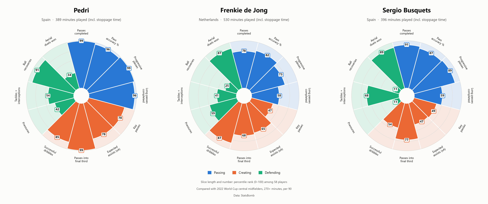
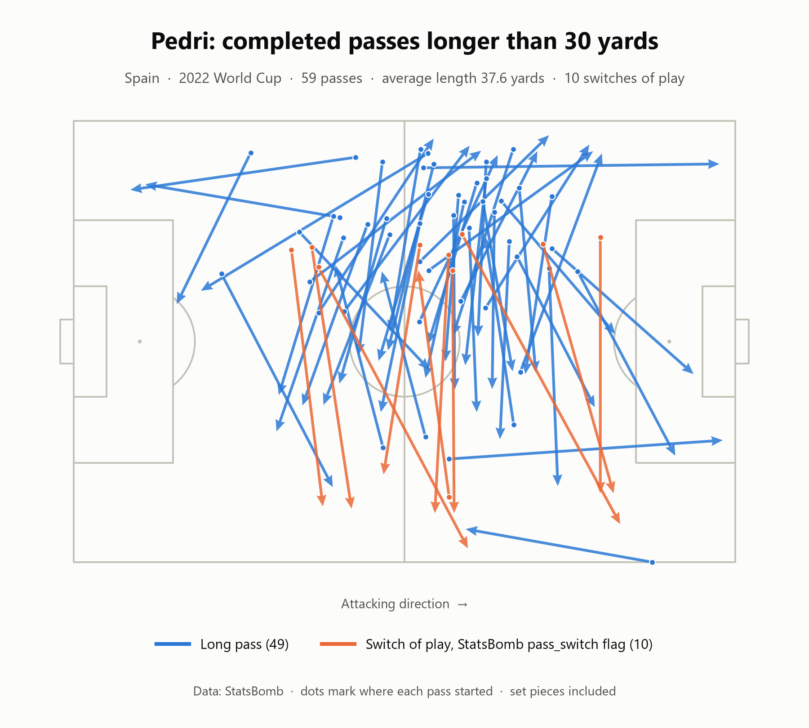
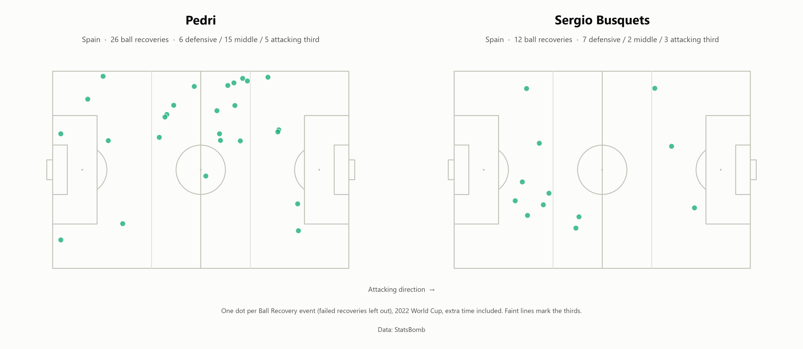

# Pedri, de Jong or Busquets? A World Cup 2022 midfielder comparison

Analysis by Md Istiak Uddin, football data analyst and grassroots coach.

Pizza charts comparing Pedri, Frenkie de Jong and Sergio Busquets with every other central midfielder at the 2022 World Cup. Twelve per-90 metrics are turned into percentile ranks, and two extra pitch maps check the numbers that need context.



*Twelve per-90 metrics as percentile ranks against 58 central midfielders (slices coloured by Passing, Creating and Defending).*



*Pedri's 59 completed passes longer than 30 yards: mostly sideways circulation, with 10 flagged as switches of play.*



*Where Pedri (26) and Busquets (12) won the ball back, one dot per recovery.*

## Key findings

Pedri was the standout ball-progressor of the three, ranking first of the 58 central midfielders (99th percentile) for passes completed, progressive passes and passes into the final third.

His 96th-percentile long passing needs context: a pass map shows most of his 59 long passes were sideways circulation across the pitch, not long balls forward (49 went further across the pitch than up it, and only 10 were switches of play).

De Jong's biggest strengths were successful dribbles and aerial duels won (87th percentile for both). His weakest area was ball recoveries (25th percentile). He played as a defensive midfielder for the Netherlands, which suggests he wasn't just a deep passer: he could also carry the ball past opponents and help his team move it forward.

Pedri also won the ball back far more often than his teammate Busquets (6.0 vs 2.7 recoveries per 90). Because they played in the same team, team style can't explain the gap. On average, Pedri's recoveries came further up the pitch, which points to different roles, but with only 12 recoveries for Busquets, this is a hint rather than proof.

## Method

- **Data:** StatsBomb open data, all 64 matches of the 2022 World Cup (events and lineups).
- **Comparison group:** central midfielders, meaning players whose main position (the one they played most minutes in) was defensive, centre or attacking midfield, left/centre/right. Wingers and wide midfielders are excluded. A player needs 270+ minutes, which leaves 58 players.
- **Real minutes:** minutes are real time on the pitch, including stoppage time and extra time (the penalty shoot-out is excluded). A match without extra time lasted 101 minutes on average (96 to 117), so a full game is worth about 101 minutes, not 90. Minutes come from lineup positions, with presence rebuilt from substitutions, treatment exits and red cards because some lineup times in the feed are wrong.
- **Per 90:** every metric is a total divided by real minutes played, times 90.
- **Percentiles:** each per-90 value is ranked within the 58-player group (`scipy.stats.percentileofscore`, `kind="mean"`, so ties share the middle rank). With 58 players, the top rank is the 99th percentile.
- **Progressive pass:** a simplified version of FBref's definition, so counts run slightly higher than FBref's (FBref measures the 10 yards from the furthest point the ball reached in the previous six passes; here each pass is judged on its own). A completed, open-play pass (no corner, free kick, throw-in, goal kick or kick-off) that starts at least 48 yards from the team's own goal line (outside the team's own 40% of the pitch) and either moves the ball at least 10 yards towards the opponent's goal line or ends inside the penalty box after starting outside it.
- **Other definitions:** a long pass is a completed pass longer than 30 yards. A ball recovery is a Ball Recovery event that StatsBomb doesn't flag as a failed recovery. The full definitions of all 12 metrics are commented in `midfielder_comparison.py`.

## Limitations

Each player has only 4 to 5 matches (Pedri 4, Busquets 4, de Jong 5), so treat small percentile differences cautiously. Busquets has just 12 recoveries, so the comparison of where the two won the ball is suggestive rather than conclusive.

## How I checked the numbers

These scripts are kept in the project because they show how the numbers were verified. Each one reuses the chart code's data loading and definitions, and compares its counts with the totals behind the pizza charts.

| Script | What it checks | What it found |
|---|---|---|
| [`check_long_passes.py`](check_long_passes.py) | The "Long passes completed" metric. Draws Pedri's completed passes over 30 yards as arrows and counts them, with their average length and StatsBomb's `pass_switch` flag, for all three players. | Pedri 59 (average 37.6 yards, 10 switches), de Jong 33 (37.0, 5), Busquets 25 (38.1, 4). All counts equal the chart totals. The map shows most of Pedri's long passes going across the pitch. |
| [`check_recoveries.py`](check_recoveries.py) | The "Ball recoveries" metric. Maps every recovery by Pedri and Busquets and counts them by third of the pitch and by distance from their own goal. | Pedri 26 (6 defensive third, 15 middle, 5 attacking, 65.0 yards from own goal on average); Busquets 12 (7, 2, 3, 52.7 yards). Both totals equal the chart totals. |

## Tools

Python, [statsbombpy](https://github.com/statsbomb/statsbombpy), [mplsoccer](https://mplsoccer.readthedocs.io/), pandas, NumPy, SciPy and Matplotlib.

## How to run

```bash
python -m venv .venv
.venv\Scripts\activate          # macOS/Linux: source .venv/bin/activate
pip install -r requirements.txt

python midfielder_comparison.py   # the pizza charts, comparison_group.csv and a printed check table
python check_long_passes.py       # long-pass check
python check_recoveries.py        # ball-recovery check
```

The first run downloads the tournament data and caches it in `.cache/`, so later runs are fast. `check_long_passes.py` also downloads the 9 Spain and Netherlands matches in full, because the cache doesn't keep the `pass_switch` flag. Everything is written to `output/`. Options for the main script: `--refresh` downloads the data again, `--output-dir DIR` changes where files are written.

`output/comparison_group.csv` lists the 58 comparison players with their minutes, per-90 values and percentiles.

## Data

Data: [StatsBomb](https://github.com/statsbomb/open-data)
